  

 

<!-- GITHUB_ARCADE_STATS:START -->

| ⭐ XP | 🎮 Lv | 💻 Commits | 🔥 Streak |
|:---:|:---:|:---:|:---:|
| **510** | **2** | **39** | **1** |

<!-- GITHUB_ARCADE_STATS:END -->

  
  
  

  

  

 

  

