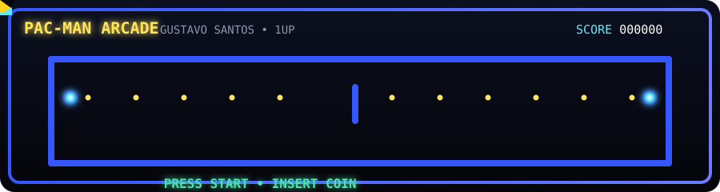
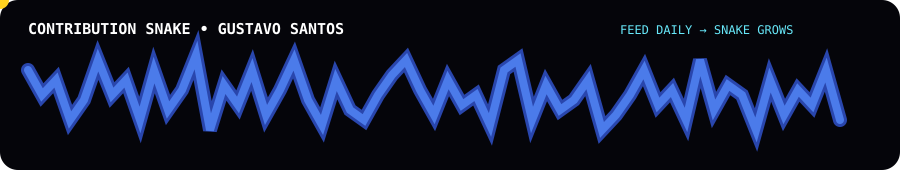

<div align="center">

# 👋 Gustavo Santos

### 🕹️ Desenvolvedor Full Stack em formação • Pac-Man Player Level 1

> *Cada commit é um pellet • Cada projeto é um nível • Cada bug é um fantasma a ser vencido.*

</div>

---

## 🕹️ O JOGO COMEÇA

<div align="center">

> 🎮 **Este perfil é um jogo.** Olhe para a cena abaixo — o Pac-Man está percorrendo o mapa comendo pellets enquanto fugia dos fantasmas. No meu mundo, **você (o visitante) acompanha minha jornada de commit em commit, level up em level up.**



</div>

---

## 📖 Como funciona o sistema

O meu GitHub virou um fliperama. Cada contribuição alimenta um sistema de progressão arcade:

| 🎮 Mecânica | O que significa |
|:---:|---|
| 🟡 **Pellet** | Dia com pelo menos 1 commit |
| 🟢 **Power-Up** | Dia com muita atividade (8+ commits) |
| 👻 **Fantasma** | Os obstáculos, bugs e procrastinação que enfrento |
| ⭐ **XP** | Acumulo por cada commit e mais bônus por sequência |
| 🎮 **Level** | Evolui a cada 500 de XP |
| 🔥 **Streak** | Sequência de dias seguidos codando |
| 🏆 **Conquistas** | Badges desbloqueadas por marcos |

<!-- GITHUB_ARCADE_STATS:START -->
<div align="center">

### 🏆 Arcade Stats

| 🏆 Score | 🎮 Level | ⭐ XP | 📈 Progresso p/ próximo nível |
|:---:|:---:|:---:|:---:|
| **49** | **1** | **495** / **500** | **99.0%** |

| 💻 Commits | 🔥 Streak | 📅 Dias ativos | 🏅 Conquistas |
|:---:|:---:|:---:|:---:|
| **38** | **1** | **15** | `🎮 Rookie` |

</div>
<!-- GITHUB_ARCADE_STATS:END -->

---

## 📊 Quadro Geral

<div align="center">


<br><br>


<br><br>


</div>

---

## 🐍 A Cobra da Contribuição

<div align="center">

> Enquanto o Pac-Man come os pellets, a Snake engole o mapa. **Contribua tanto que a cobra cresce até o infinito.**



</div>

---

## 🛠️ Tech Stack

<div align="center">


</div>

---

## 🚧 Jornada de Aprendizado

```text
Python                  ██████████████████░░░░░░░░░░░░░░░  Evoluindo
JavaScript              ████████████████░░░░░░░░░░░░░░░░░  Evoluindo
TypeScript              ████████░░░░░░░░░░░░░░░░░░░░░░░░░  Explorando
PHP                     ██████████████████░░░░░░░░░░░░░░░  Evoluindo
SQL                     ██████████████████░░░░░░░░░░░░░░░  Praticando
HTML + CSS              ████████████████████░░░░░░░░░░░░░  Praticando
React / Node            ██████░░░░░░░░░░░░░░░░░░░░░░░░░░░  Estudando
Docker                  ██████████░░░░░░░░░░░░░░░░░░░░░░░  Estudando
Inteligência Artificial ████████░░░░░░░░░░░░░░░░░░░░░░░░░  Explorando
```

---

## 🗺️ Roadmap (Maze Map)

- [x] 🔹 Fundamentos de programação
- [x] 🔹 Projetos próprios
- [x] 🔹 Git e GitHub
- [ ] 🔸 Full Stack Web
- [ ] 🔸 SaaS completo
- [ ] 🔸 APIs & arquitetura
- [ ] 🔸 Estruturas de dados e algoritmos
- [ ] 🔸 Inteligência Artificial
- [ ] 🔸 Open Source & contribuições

---

## 🚀 Projetos em destaque

### 🌐 Nexus Hub

> Plataforma para reunir recursos, ferramentas, documentações e materiais para desenvolvedores — uma espécie de "mapa do labirinto" para quem está começando.

[➜ Ver no GitHub](https://github.com/gustavosantanasilva/Nexus-Hub)

### 🧠 Próximas "fases" a desbloquear

🤖 IA • 🚀 SaaS • 🌐 Sistemas Web • 🔌 APIs • 🗄️ Banco de dados • ⚙️ Automação

---

## 🏆 Conquistas Arcade

Evolua comigo:

| 🥉 Bronze | 🥈 Prata | 🥇 Ouro |
|:---|:---|:---|
| 🎮 Rookie (1 commit) | ⚡ Coder (50) | 🔥 Grinder (150) |
| 📅 Week (Streak 7d) | 📆 Month (Streak 30d) | 🚀 Build (400 commits) |
| — | 💪 Active (150 dias) | 🏆 Legend (1000 commits) |

---

## 📫 Conecte-se comigo

<div align="center">

<a href="https://github.com/gustavosantanasilva">
  
</a>
<a href="https://www.linkedin.com/in/gustavo-santos-13111a385/">
  
</a>

</div>

---

<div align="center">

### 🟡 INSIRA SUA MOEDA • PRESSIONE START • JOGUE A VIDA TODA 👾


</div>