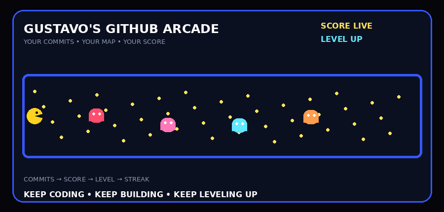

<div align="center">

# 👋 Gustavo Santos

### 💻 Desenvolvedor em formação • Full Stack • Criador de projetos



### 🕹️ GUSTAVO'S GITHUB ARCADE

> 🚀 Aprendendo, construindo e transformando ideias em software.

</div>

---

## 🧑‍💻 Sobre mim

Sou estudante e desenvolvedor em formação, apaixonado por programação e por transformar ideias em projetos reais.

Meu foco é evoluir como **desenvolvedor Full Stack**, criando aplicações web, APIs, sistemas com banco de dados e experimentando novas tecnologias.

```text
Gustavo Santos
├── 💻 Desenvolvimento de Software
├── 🌐 Full Stack
├── 🐍 Python
├── 🐘 PHP
├── ⚡ JavaScript
├── 🗄️ SQL
├── 🤖 Inteligência Artificial
└── 🚀 SaaS & Projetos próprios
```

---

## 🕹️ Meu GitHub virou um jogo

Cada commit ajuda o Pac-Man a avançar.

| 🎮 Mecânica | Como funciona |
|---|---|
| 🟡 Pellet | Dia com contribuição |
| 🟢 Power-up | Dia com muita atividade |
| 👻 Fantasmas | Obstáculos do caminho |
| 🏆 Score | Baseado nos commits |
| 🔥 Streak | Sequência de dias ativos |
| ⭐ Level | Evolui com o score |

<!-- GITHUB_ARCADE_STATS:START -->
<div align="center">

### 🏆 Arcade Stats

| 🏆 Score | 🎮 Level | 💻 Commits | 🔥 Streak | 📅 Dias ativos |
|:---:|:---:|:---:|:---:|:---:|
| **0** | **1** | **0** | **0** | **0** |

</div>
<!-- GITHUB_ARCADE_STATS:END -->

---

## ⚡ Tech Stack

<div align="center">

</div>

---

## 🚀 Projetos em destaque

### 🌐 Nexus Hub

Plataforma para reunir recursos, ferramentas, documentações e materiais para desenvolvedores.

[→ Ver projeto](https://github.com/gustavosantanasilva/Nexus-Hub)

### 🧠 Próximos projetos

🤖 IA • 🚀 SaaS • 🌐 Sistemas Web • 🔌 APIs • 🗄️ Banco de dados • ⚙️ Automação

---

## 📚 Atualmente estudando

```text
Python                  ████████████████░░  Evoluindo
JavaScript              ██████████████░░░░  Evoluindo
PHP                     ██████████████░░░░  Evoluindo
SQL                     ███████████████░░░  Praticando
HTML + CSS              █████████████████░  Praticando
Git + GitHub             ████████████████░░  Praticando
Docker                  ██████████░░░░░░░░  Estudando
Inteligência Artificial ████████░░░░░░░░░░  Explorando
```

---

## 🎯 Roadmap

- [x] Fundamentos de programação
- [x] Projetos próprios
- [x] Git e GitHub
- [ ] Full Stack
- [ ] SaaS completo
- [ ] APIs e arquitetura
- [ ] Estruturas de dados
- [ ] Inteligência Artificial
- [ ] Open Source

---

## 📊 GitHub Stats

<div align="center">


<br><br>


</div>

---

## 🐍 Contribution Snake

<div align="center">

</div>

---

## 📫 Conecte-se comigo

<div align="center">

<a href="https://github.com/gustavosantanasilva"></a>
<a href="https://www.linkedin.com/in/gustavo-santos-13111a385/"></a>

</div>

---

<div align="center">

### 🟡 KEEP CODING • KEEP BUILDING • KEEP LEVELING UP 👾


</div>
# gustavosantanasilva
